# Result Assignments


## Biggest problem right now.
There isn't a mobile interface right now. You can't navigate the results after you entered your search.

#### Todo
* [ ] Make a mobile friendly version.

## Network

I ran these tests with the user in mind and when the app reaches above the 10 seconds i see that as a challenge to fix. [Because on slow 3G people mostly wait around 10 seconds.](https://www.nngroup.com/articles/response-times-3-important-limits/)

My app doesn't have a timeout or a loader in that sense. So the user wouldn't know what is going on.


_Network results from the app._


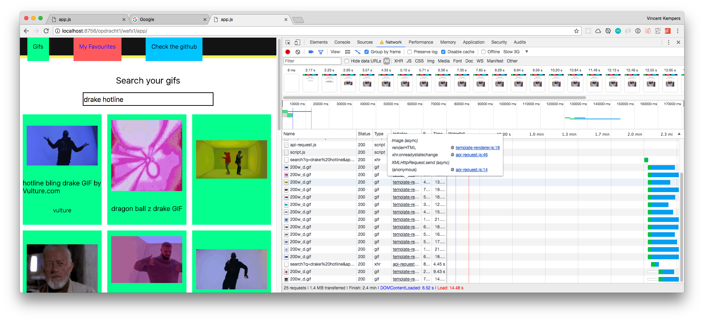

_The load on after a search can take a long time on low network._

We hit around the 2 minutes. A user that typed something has to wait 2 minutes when the content loads. That takes way too long.

If internet fails while loading the page nothing happens but when you already loaded the site and the internet fails. You get an error message. That error message isn't specific but it will let the user know "Something is wrong!". There should be a better 200 handler.

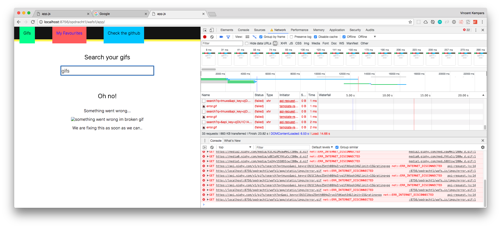

_Error message in the app tested with google chrome dev network._

The CSS in the app isn't that much! But it could load a bit faster with critical CSS.
I could fix this with critical CSS and minify my CSS to save some time and make the app a bit lighter to load!
> [Source: critical css](https://criticalcss.com/)

#### Todo
* [ ] Show a better error message.
* [ ] Create a timeout! (if it takes too long cut off).
* [ ] Make use of Critical CSS.

## Screenreader

How I tested the Screenreader was with macOS built-in Screenreader function. Things i noticed:

Tested on:

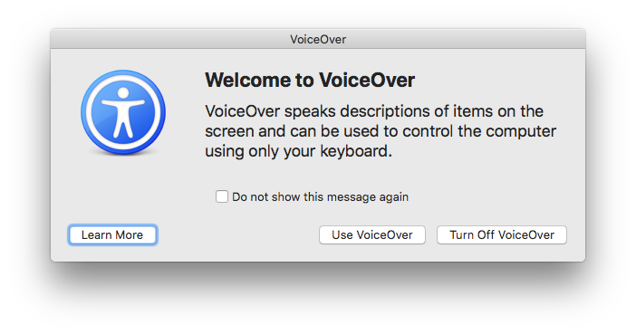

_Image of the screenreader app i use_

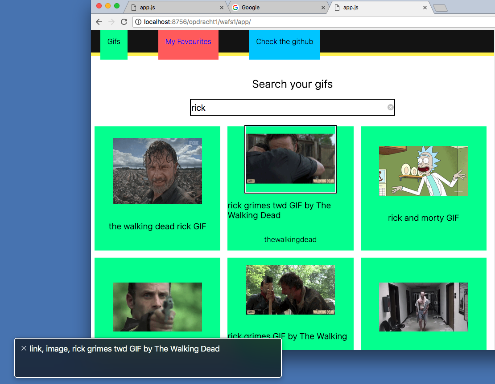

_Image doesn't read the title twice. Even though it has the title in the alt=""_


#### Todo

* [ ] leave the `alt=""` attribute empty
* [ ] Make sure other screen-readers doesn't have to read a title twice.
* [ ] In VoiceOver the title isn't being read twice but it could still occur on other screen-readers
* [x] Sometimes the tone of voice is a bit weird (this was a setting on my part).

## Images from the API

Having network in mind the previews you see are downsampled. This means it saves some time to get the gifs. To preview this i used the originals to preview on slow network, and preview the downsampled to show the speeds.

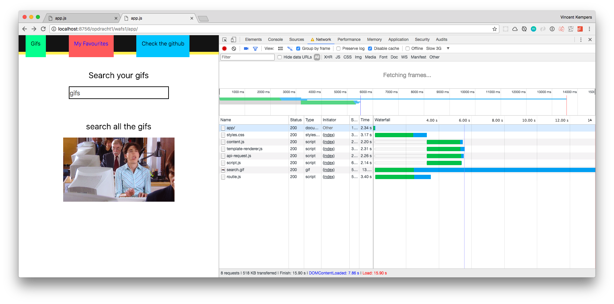

_original image speeds_


_smaller downsampled image speeds_

#### Todo

* [ ] No alt tag on the images and let it read the title!
* [ ] On reduced motion show the still image. and when clicked show the downsampled image.

## localStorage - Cookies

localStorage is being used in this app. To disable your localStorage in different browsers you sometimes need to access your about.config or it's being found in your settings. [Here is a explination on how](https://stackoverflow.com/questions/17882647/can-user-disable-html5-sessionstorage#25050910).

By intentional breaking the localStorage in my app the whole app won't work! it will timeout eventually because of the browser.
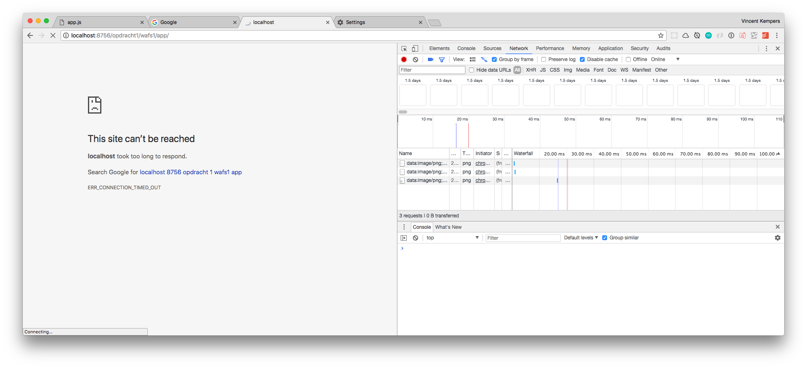
_This is the result of changing localhost to Docalhost in the app._

The localStorage in this app is being used to favourite your gifs. The app stores a string that contains a JSON format to write in the localStorage. This could be stored in your cache to remember or you could have a user login and store the favourites on the server/(account).

#### Todo
* [ ] Have a database on the server.
* [ ] Saves the users favourites on the server.
* [ ] Get the Id's from the server and show them on the web.

## Javascript off
When JavaScript is off the app doesn't work there is no way this app can do it's functionality when JavaScript is off. But i could inform the user when JavaScript is off. Probably make use of `<noscript>` or Try to make the favourites functionality slightly work by showing you.

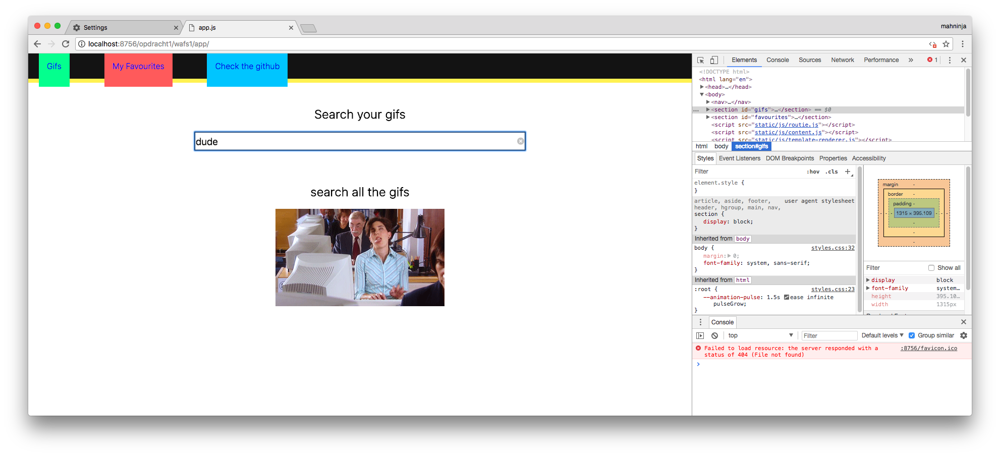
_JavaScript is off! You can still visit the page but after typing it gives you a 404 file is missing._

* [ ] The user doesn't know why the search doesn't work!?
* [ ] JS is off screen.
* [ ] My core functionality can't be done without JavaScript.


## Colourblind / Accessibility
Tested with a colourblind filter named sim daltonism. Get sim daltonism on macOS [here](https://michelf.ca/projects/mac/sim-daltonism/). The results from the tests are:

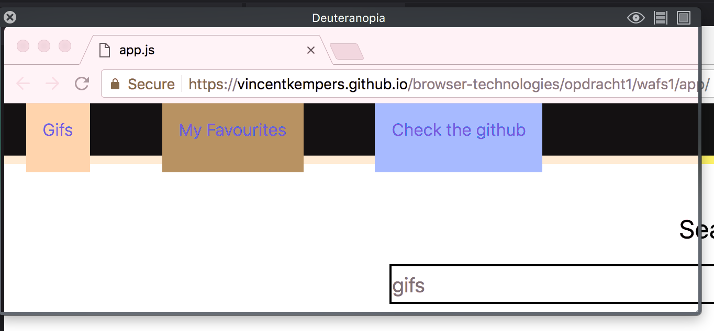

_Deuteranopia colour filter over the app_

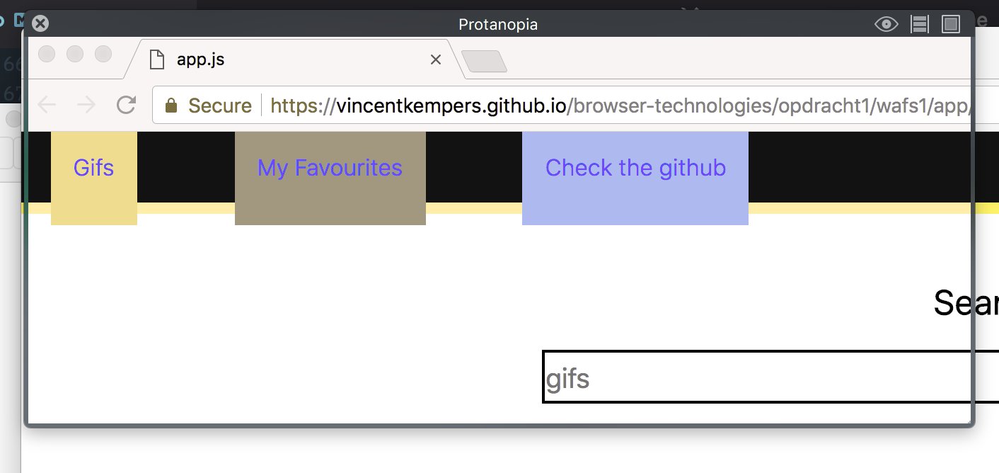

_Protanopia colour filter over the app_

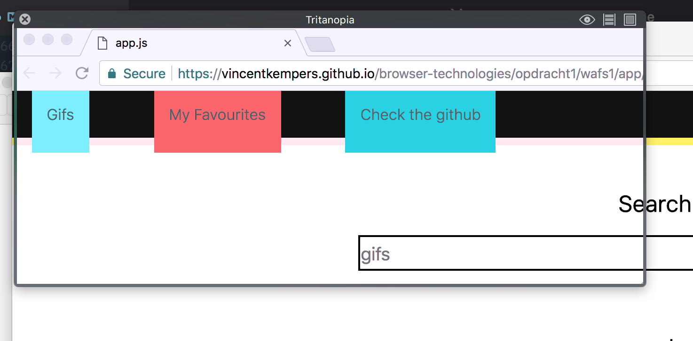

_Tritanopia colour filter over the app_

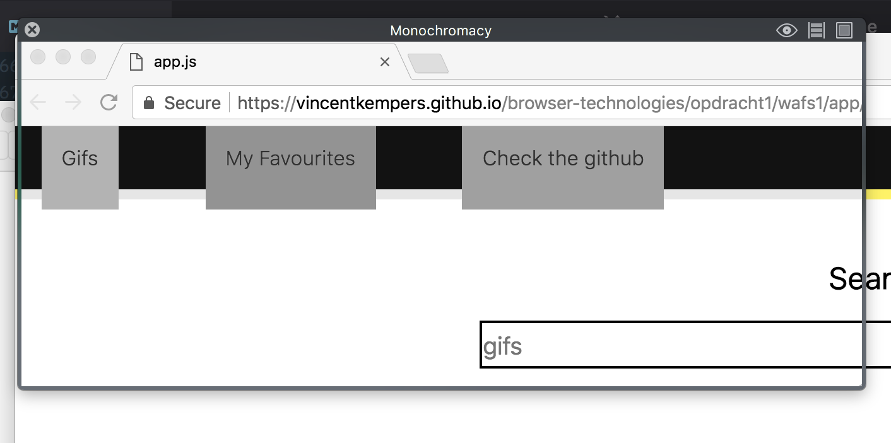

_Monochrome colour filter over the app_

On a bad monitor are the navigation links pretty bad! The font on windows is too thin. In that case we need to make the font bold or a thicker font. On the contrast spectrum the blue on blue doesn't work!

## Focus states
There is a infinite animation as focus state. Which could be very annoying! The focus state is important but in this case the focus state is a bit too much for viewing an Animated gif.

#### Todo
* [ ] Make the navigation links black.
* [ ] Text in navigation should be bold.
* [ ] Focus states.
  * [ ] Change the default focus state to more than just a bounce an Animation on a animation doesn't really work.
  * [ ] Subtle animation or a much clearer difference when you tab on an item.


## Browsers

The main browser i use is Google Chrome. I use this to test all my code and make my apps in. Also I use it as my daily driver. Therefor i didn't added it to this list.

### Tested on Firefox
Problems i found:
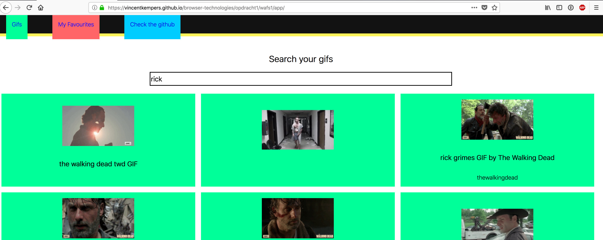
_Looking for rick in the app on Firefox_

#### Todo
* [ ] Focus states.
* [ ] Navigation links are a problem.

### Tested on Opera
Problems i found:
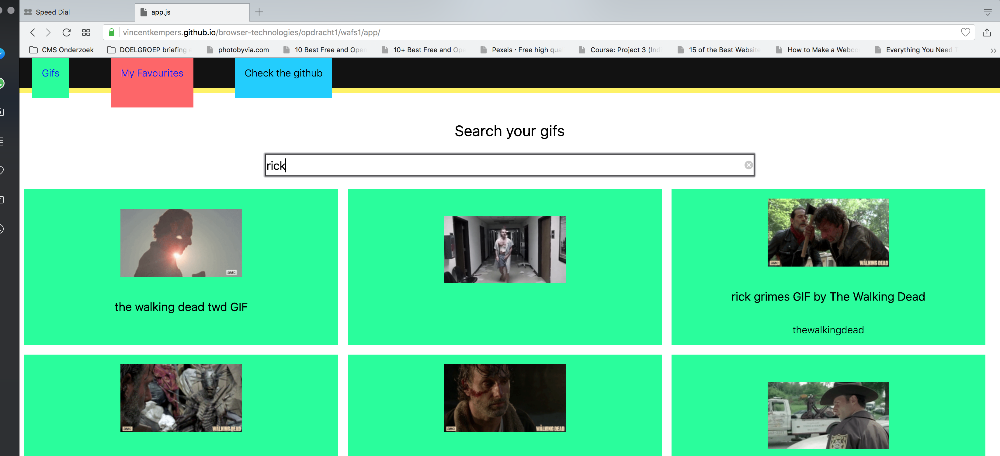

When tabbed on inside the app the (starting) image disappears, this is actually the same bug that happends in Safari. The only difference in opera is that the starting gif doesn't reappear. This bug happens when you search and get results but it shows the results again without making a new call.

#### Todo
* [ ] Probably should wait with making a new call every time you type.
* [ ] If the above doesn't fix the problem. I should remove the `.innerHTML` to `insertAdjacentHTML()`.
* [ ] The h3's are a bit too thin, redo the system font.
* [ ] different results on Opera? Couldn't figure out why?

## Opera Mobile & Opera Mini
Tested it on the Opera Mobile emulator on macOS. You can download it [here](https://www.opera.com/nl/developer/mobile-emulator).
The tool works very good. You can navigate the phone, check websites if they work, and you can download and save on your desktop.
Technically you could download opera mini with the emulator. But it didn't work for me, unfortunately.
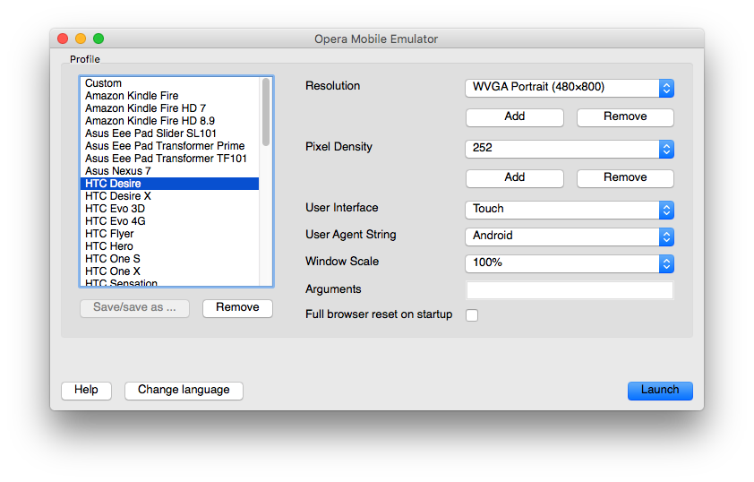
_The interface_

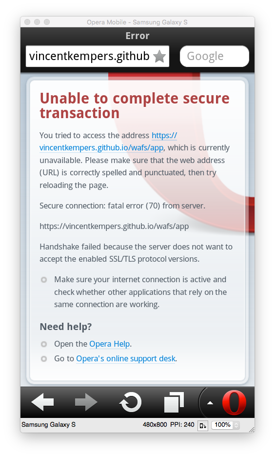
_Result! via Githubpages link_

Well, the app doesn't work on opera-mobile. It doesn't like the Github link i'm sending. Weirdly enough. It has a problem with the handshake of the protocols. But localhost works! even though it said it wouldn't? (it wouldn't even go to [Github](https://github.com))

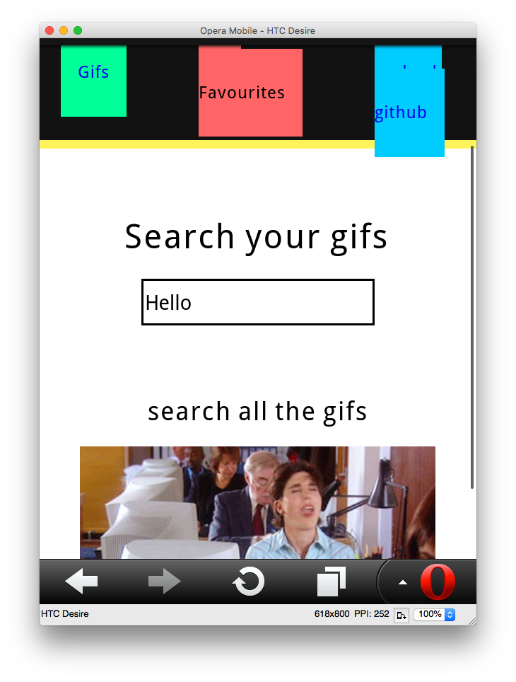
_Result! via localhost link_

Well the page loads! But i'm not getting a result after a search. Which is problematic, because it's a key functionality. I can't navigate to the favourites, because there is probably no JavaScript or the ES6 way of templating doesn't work on Opera Classic. I can't see whats actually going on.


#### Todo
* [ ] Make the basics (like navigation) work with just HTML and CSS
* [ ] Get rid of everything ES6. Not compatible on older browsers, as you can see in results.
* [ ] This would mean a part of the world can't view (via github) or use my page.
* [ ] make a call for the https:// (just in case)


### Tested on Safari
Problems i found:
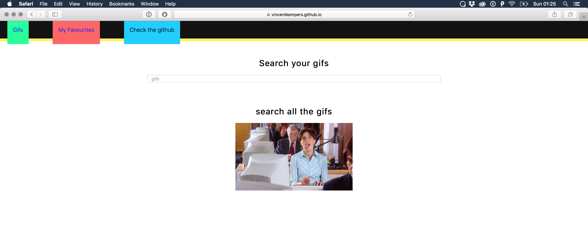
_Apparently the search field looks very weird in safari._

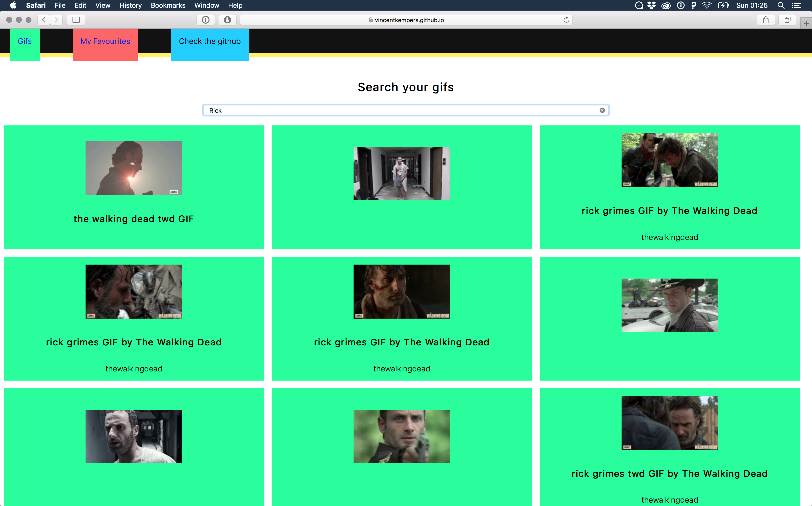
_It looks the same_

There is a weird bug when you try to tab in safari. It is trying to reload in all the images, even though i am tabbed in the search bar. This is probably the active search call that is happening (when you type). When you focus on a search there is a very small moment when this happens.

#### Todo
* [ ] don't make a call every time you type.
* [ ] make use of the filter function.
* [ ] make a call after a submit!.

### Tested on Microsoft Edge
Problems i found:
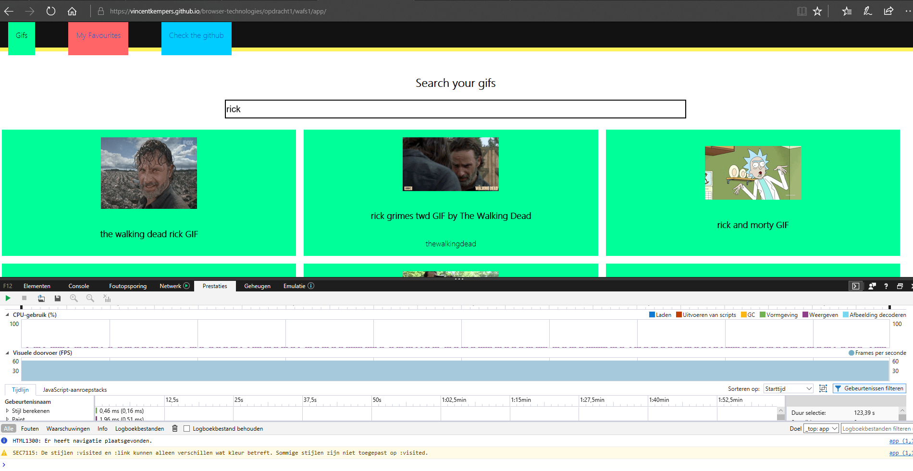
_Microsoft Edge test_

So there is a problem with the `:visited` tag. Had the same tab bug that has occurred with browsers like Safari and Opera. Focus states from the browser itself were poor. Loading the page in slow speeds worked fine. Couldn't throttle the internet to my windows machine, so i used the dev tools instead.

#### Todo
* [ ] Font worked well, personally thought it was a bit thin on the bad monitor.
* [ ] Colours were a bit different on this machine, therefor some contrast was off.
* [x] The app worked fine.
* [ ] Get rid of the animations on focus states you get a bit nauseous.
* [ ] Colours were to bright on high contrast.

### Tested on Internet Explorer 11
Problems i found:
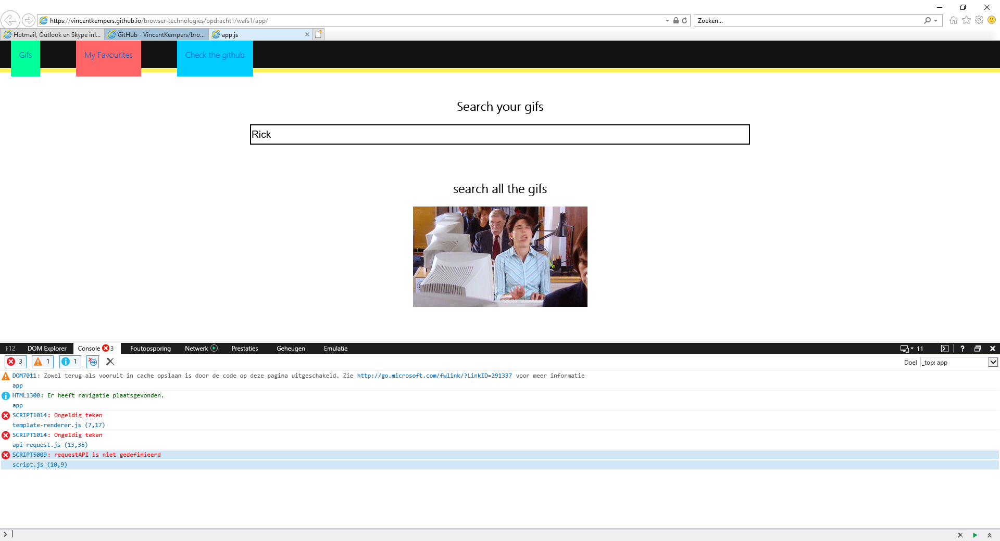
_Issues i found on internet explorer 11_

I tested the internet explorer on a pretty bad monitor (not because all IE11 users have bad monitors)

Internet Explorer 11 giving me errors about ES6 template literals.
```JS
 var html = `<h1>${name}</h1>`; // the "``" is a problem in IE11
 ```
He refuses to make the call because of the ES6 elements. this problem could be fixed if i used vanilla JavaScript templating.
example:
```JS
 var html = "<h1>" + name + " </h1>"; // Should be fixed now!
 ```
I was mostly concerned by display grid. But it has partial support if the `-ms-` prefix is used.

Tabbing through IE11 wasn't really a problem. But knowing where you were was. The browser standard focus wasn't good enough to know what was going on or knowing where you left. Redesign the focus state, don't use animations on IE11 and definitely make the contrast better.

In the navigation the letters are too thin. Rather use bold letters because the links are just horrible too see on a bad monitor.

#### Todo

* [ ] Write the templating in vanilla JavaScript.
* [ ] Use `-ms-` prefix!.
* [ ] The focus states on ie11 (the animation) doesn't work.
* [ ] When tabbed the focus state of the browser is minimal. Need to make a more expressive focus state.
* [ ] noticed that browser didn't like redoing the call every time, definitely need a spinner/loader.


### Tested on The Device Lab
Problems i found:
First things first some of the older devices couldn't even reach my app because they gave a (something is wrong with the page error)! Most of the devices showed my page but the core functionality didn't work, because there wasn't a HTTPS request. It would do animations and you can type but the call isn't made.

The website isn't responsive so there are loads of bugs and errors!

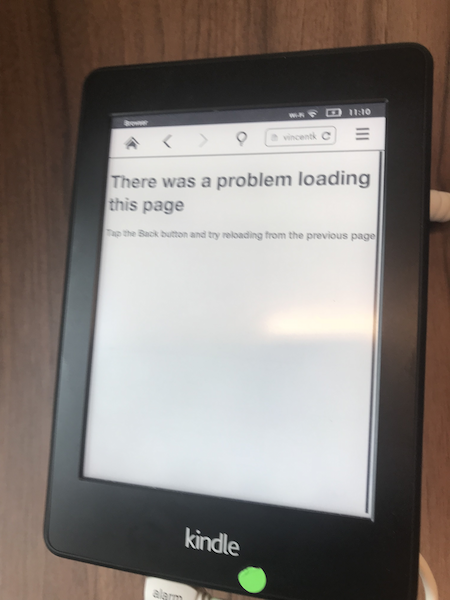 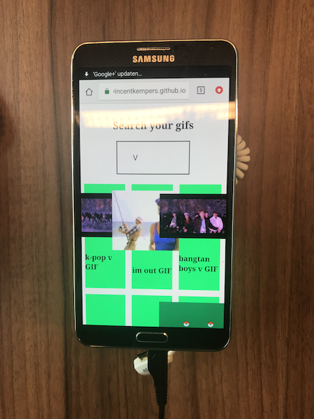 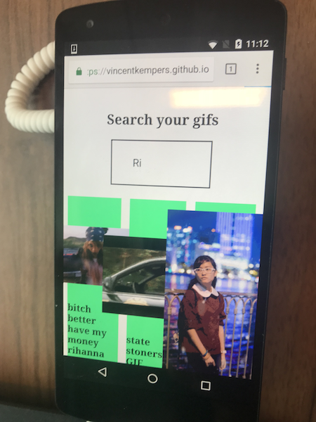


#### Todo

* [ ] HTTPS connection with the API (This is possible with Giphy).
* [ ] Not responsive.
* [ ] couldn't save favourites.
* [ ] Not responsive.


## audit

- Google dev Lighthouse in Dev Tools 
_Google audit run_

Added the errors of Google Lighthouse to this readme. Items like critical CSS isn't really needed if the app stays very light. Just in case I added it. Because the assignment states "if you have all the money and time".

#### Todo

* [ ] Splash screen.
* [ ] Service worker.
* [ ] On mobile use still images to load faster.
* [ ] Mobile first and critical CSS (even though it's pretty lightweight CSS, this should be decided on how many CSS is added in the end).
* [ ] Minify the code!
* [ ] Make use of cache to keep loading short!

## Link to the app

[link to the app](https://vincentkempers.github.io/wafs/app/#gifs)
