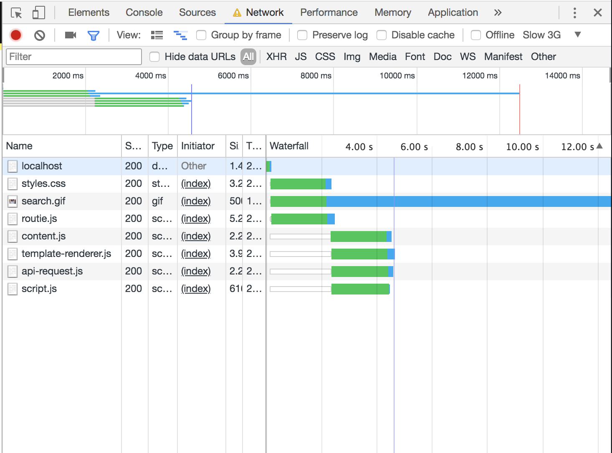
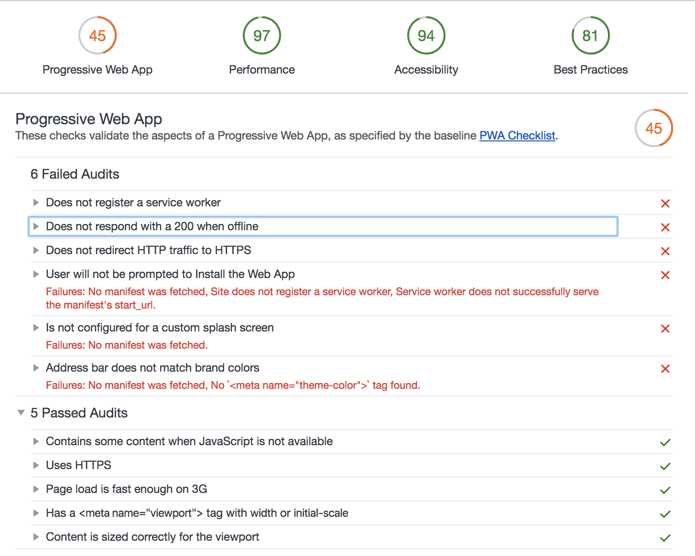

# Result Assignments

- [x] Your code on Github.
- [x] Write a Readme with a description of the problem that you have encountered, how did you fix them or how could you fix them (with todo's) if you had enough time.

## Biggest problem right now.
There isn't a mobile interface right now. You can't navigate the results after you entered your search.

#### Todo
- [ ] Make a mobile friendly version.

## Network

My app doesn't have a timeout or a loader in that sense. So the user wouldn't know what is going on.

_The load on after a search can take a long time on low network._

If internet fails while loading the page nothing happends but when you already loaded the site and the internet fails. You get an error message. That error message isn't specific but it will let the user know "Something is wrong!". There should be a better 200 handeler.

_Error message in the app tested with google chrome dev network._

The CSS in the app isn't that much! But it could load a bit faster with critical CSS.

_Showing the paint of the webpage on in Chrome Developer tools network_

I could fix this with critical CSS and minify my CSS to save some time and make the app a bit lighter to load!
> [Source: critical css](https://criticalcss.com/)

#### Todo

## Screenreader

How I tested the Screenreader was with macOS built-in Screenreader function. Things i noticed:

- [ ] Titles being read twice.
- [ ] Sometimes the tone of voice is kind of weird.

Tested on:

_Image of the screenreader app i use_

_Image of the screenreader app i use on mobile_

#### Todo

- [x] leave the `alt=""` attribute empty

## Images from the API

Having network in mind the previews you see are downsampled. This means it saves some time to get the gifs. To preview this i used the originals to preview on slow network, and preview the downsampled to show the speeds.

_original image speeds_

_original image speeds_

- [ ] No alt tag on the images and let it read the title!
- [ ] On reduced motion show the still image. and when clicked show the downsampled image.

## localStorage - Cookies

localStorage is being used in this app. To disable your localStorage in different browsers you sometimes need to access your about.config or it's being found in your settings. [Here is a explination on how](https://stackoverflow.com/questions/17882647/can-user-disable-html5-sessionstorage#25050910).

The localStorage in this app is being used to favourite your gifs. The app stores a string that contains a JSON format to write in the localStorage. This could be stored in your cache to remember or you could have a user login and store the favourites on the server/(account).

- Database op de server.
- Die users onthoud en registreert welke id van de image is opgeslagen.
- Favorieten zou in het geval van cachen wel kunnen.

#### Todo

## Javascript uit
Javascript is een interessante topic. Gelieve zou ik het willen proberen de core functionaliteit (het zoeken) zonder Javascript willen doen. Wat vrij lastig is natuurlijk. Het is misschien niet viable omdat ik een call doe + strings opsla in local host etc. Maar op zijn minst je favorieten zien en denk ik laten weten of javascript staat uit en de ervaring hier door erg gelimiteerd is.

## Minify the code

#### Minify CSS

#### Todo

#### Minify JS

#### Todo

## Kleur/ Accessibility
Het contrast van de kleuren werken vrij goed. Mag misschien wat dikkere font soms. Focus states mogen misschien net even wat getweaked worden. Puur om het feit dat hij wel beweegt van waar je bent. Alleen misschien is het nog te subtiel, kleur zou een goede oplossing hier voor zijn.

#### Todo

## browsers

### Tested on Firefox
Problems i found:

#### Todo

### Tested on Opera
Problems i found:

#### Todo

### Tested on Opera Mini
Problems i found:

#### Todo

### Tested on Safari
Problems i found:

#### Todo

### Tested on Microsoft Edge
Problems i found:

#### Todo

### Tested on Internet Explorer
Problems i found:

#### Todo

### Tested on The Device Lab
Problems i found:

#### Todo

* [ ] Op mobiel de gifs ophalen als stilstaande plaatjes (indien reduced motion aanstaat).
* [ ] Splash screen.
* [ ] Service worker.
* [ ] Eerst mobile first en Critical CSS
* [ ] Javascript uit toch nog wat kunnen doen.
* [ ] Minify the code!
* [ ] Gebruik van cache!
* [ ] Focus state tweaken
  * [ ] Kleur.
  * [ ] iets subtielere animatie (reduced motion: heeft dan alsnog een focus state vanwege kleur) .

## What did i test.

<<<<<<< HEAD
- Google dev Network 
- Google dev Audit in Dev Tools 

link: https://vincentkempers.github.io/wafs/app/#gifs
