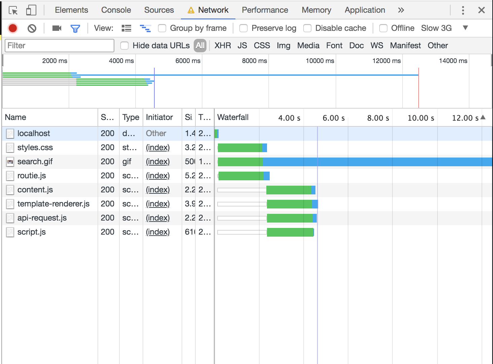
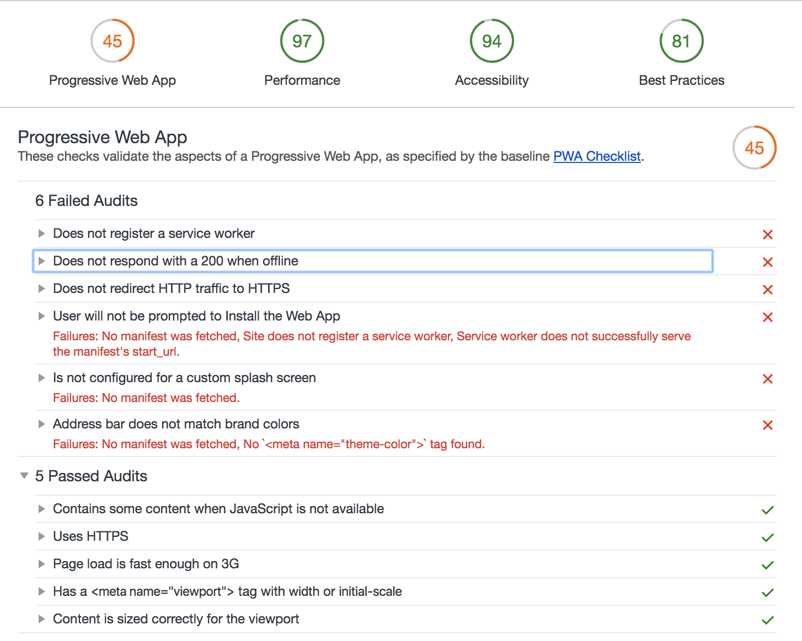

# Resultaat opdrachten

- [x] Zet je code op Github
- [x] Schrijf een Readme met een beschrijving van de problemen die je hebt gevonden, hoe je die hebt opgelost, of hoe je dit zou oplossen (met todo’s) als je genoeg tijd en budget zou hebben.

# Problemen

## Grootste problemen
Geen mobile first design. Dit moet direct gebeuren want de app moet gewoon werken op mobiel.

# Netwerk

Hij doet een call en heeft geen timeout. Alle plaatjes hebben een preview met een lage size. Die size is veel kleiner dan een normale gif.
Er worden downsampled plaatjes ingeladen. De font en tekst zijn system based. Er is geen custom font er wordt ook geen custom font ingeladen.

- Error: Stel dat je stopt met het laden van de pagina en je probeert toch te typen. Gaat dat niet. Dan krijg je een error binnen.
- Alleen op het moment dat er een 200 is. Dus voor dat de pagina laad moet er al een error afhandelen.
- Caching van de pagina of pagina's zou handig zijn. Alleen dat de functionaliteit van zoeken vrij lastig is.
  - Favorieten zou in het geval van cachen wel kunnen.

# Screenreader

Merkte dat de tonatie in het nederlands wordt gedaan terwijl het een engelse website is. Puur waarschijnlijk omdat mijn settings in het nederlands stond.
Voor de rest legt hij wel uit wat de image is en wat de image alt is.

# Images vanuit een API

Helaas kan ik er niet echt veel meer aan doen dan dat er is.
Dingen die ik al heb toegepast is:
- Images voorzien van een alt tag.
- Titel bij het plaatje.
- Alt ingevuld.
- vanuit preview het volledige HD plaatje later genereren.

# localStorage - Cookies ?

Localstorage is een feature die je gevaforiete gifs onthoud.
Het is niet zo zeer de core function van mijn app het is een extra. Op het moment dat de localStorage uit is, is er geen manier om je gifs op te slaan.
Dit zou je kunnen doen met een database. Hier een ID of User aan te geven om die de server te plaatsen zodat, het toch wordt opgeslagen.

- Database op de server.
- Die users onthoud en registreert welke id van de image is opgeslagen.

# Javascript uit
_Ik wil hier toch wat voor verzinnen_
Javascript is een interessante topic. Gelieve zou ik het willen proberen de core functionaliteit (het zoeken) zonder Javascript willen doen. Wat vrij lastig is natuurlijk. Het is misschien niet viable omdat ik een call doe + strings opsla in local host etc. Maar op zijn minst je favorieten zien en denk ik laten weten of javascript staat uit en de ervaring hier door erg gelimiteerd is.

# Kleur/ Accessibility
Het contrast van de kleuren werken vrij goed. Mag misschien wat dikkere font soms. Focus states mogen misschien net even wat getweaked worden. Puur om het feit dat hij wel beweegt van waar je bent. Alleen misschien is het nog te subtiel, kleur zou een goede oplossing hier voor zijn.

# todo

- [] Database er aan hangen.
- [] Iets van Critical CSS eraan hangen. Ongeacht dat de app vrij licht is op CSS.
- [] Op mobiel de gifs ophalen als stilstaande plaatjes (indien reduced motion aanstaat).
- [] Splash screen.
- [] Service worker.
- [] Eerst mobile first en Critical CSS
- [] Javascript uit toch nog wat kunnen doen.
- [] Minify the code!
- [] Compress images!
- [] Gebruik van cache!
- [] Focus state tweaken
  - [] Kleur.
  - [] iets subtielere animatie (reduced motion: heeft dan alsnog een focus state vanwege kleur) .

# What did i test.

- Google dev Network 
- Google dev Audit in Dev Tools 
- Verschillende browsers (Inclusief Edge)
