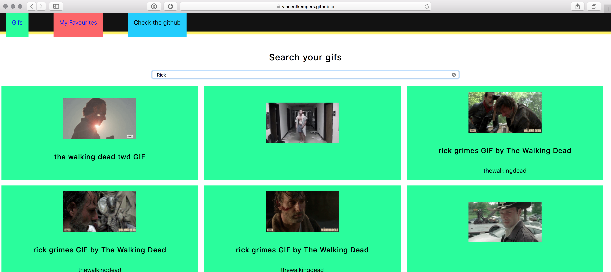

# Result Assignments

- [x] Your code on Github.
- [x] Write a Readme with a description of the problem that you have encountered, how did you fix them or how could you fix them (with todo's) if you had enough time.

## Biggest problem right now.
There isn't a mobile interface right now. You can't navigate the results after you entered your search.

#### Todo
- [ ] Make a mobile friendly version.

## Network

My app doesn't have a timeout or a loader in that sense. So the user wouldn't know what is going on.

_Network results from the app._

_The load on after a search can take a long time on low network._

If internet fails while loading the page nothing happens but when you already loaded the site and the internet fails. You get an error message. That error message isn't specific but it will let the user know "Something is wrong!". There should be a better 200 handler.

_Error message in the app tested with google chrome dev network._

The CSS in the app isn't that much! But it could load a bit faster with critical CSS.

_Showing the paint of the webpage on in Chrome Developer tools network_

I could fix this with critical CSS and minify my CSS to save some time and make the app a bit lighter to load!
> [Source: critical css](https://criticalcss.com/)

#### Todo
- [ ] Show error message.
- [ ] Create a timeout.
- [ ] Make use of Critical CSS.

## Screenreader

How I tested the Screenreader was with macOS built-in Screenreader function. Things i noticed:

- [ ] Titles being read twice.
- [ ] Sometimes the tone of voice is kind of weird.

Tested on:

_Image of the screenreader app i use_

_Image of the screenreader app i use on mobile_

#### Todo

- [x] leave the `alt=""` attribute empty
- [x] Make sure the screenreader doesn't have another title.

## Images from the API

Having network in mind the previews you see are downsampled. This means it saves some time to get the gifs. To preview this i used the originals to preview on slow network, and preview the downsampled to show the speeds.

_original image speeds_

_original image speeds_

#### Todo

- [ ] No alt tag on the images and let it read the title!
- [ ] On reduced motion show the still image. and when clicked show the downsampled image.

## localStorage - Cookies

localStorage is being used in this app. To disable your localStorage in different browsers you sometimes need to access your about.config or it's being found in your settings. [Here is a explination on how](https://stackoverflow.com/questions/17882647/can-user-disable-html5-sessionstorage#25050910).

The localStorage in this app is being used to favourite your gifs. The app stores a string that contains a JSON format to write in the localStorage. This could be stored in your cache to remember or you could have a user login and store the favourites on the server/(account).

#### Todo
- [ ] Have a database on the server.
- [ ] Saves the users favourites on the server.
- [ ] Get the Id's from the server and show them on the web.

## Javascript off
When JavaScript is off the app doesn't work there is no way this app can do it's functionality when JavaScript is off. But i could inform the user when JavaScript is off. Probably make use of `<noscript>` or Try to make the favourites functionality slightly work by showing you.

- [ ] Figure out if it's still viable to have a "JS is off screen"
- [ ] JS is off screen.

## Minify the code
Minified code can safe some load time. This load time have more effect on slow download speeds (slow 3G/GPRS/EDGE).  

#### Todo
- [ ] Minify the CSS
- [ ] Minify the JS
- [ ] Minify the HTML

## Colourblind / Accessibility
Tested with a colorblind filter named sim daltonism. Get sim daltonism on macOS [here](https://michelf.ca/projects/mac/sim-daltonism/). The results from the tests are:

_Deuteranopia color filter over the app_

_Protanopia color filter over the app_

_Tritanopia color filter over the app_

_Monochrome color filter over the app_

## Focus states
There is a infinite animation as focus state. Which could be very annoying! The focus state is important but in this case the focus state is a bit too much for viewing an Animated gif.

#### Todo
- [ ] Make the navigation links black.
* [ ] Focus state tweaken
  * [ ] Kleur.
  * [ ] iets subtielere animatie (reduced motion: heeft dan alsnog een focus state vanwege kleur) .

## Browsers

The main browser i use is Google Chrome. I use this to test all my code and make my apps in. Also I use it as my daily driver. Therefor i didn't added it to this list.

### Tested on Firefox
Problems i found:

_Looking for rick in the app on firefox_

#### Todo

### Tested on Opera
Problems i found:

When tabbed on inside the app the 
#### Todo

### Tested on Opera Mini
Problems i found:

#### Todo

### Tested on Safari
Problems i found:

_Apparently the search field looks very weird in safari._

_It looks the same_

There is a weird bug when you try to tab in safari. It is trying to reload in all the images, even though i am tabbed in the search bar. This is probably the active search call that is happening (when you type). When you focus on a search there is a very small moment when this happens.

#### Todo

### Tested on Microsoft Edge
Problems i found:

#### Todo

### Tested on Internet Explorer
Problems i found:

#### Todo

### Tested on The Device Lab
Problems i found:

#### Todo

* [ ] Op mobiel de gifs ophalen als stilstaande plaatjes (indien reduced motion aanstaat).

* [ ] Eerst mobile first en Critical CSS
* [ ] Javascript uit toch nog wat kunnen doen.
* [ ] Minify the code!
* [ ] Gebruik van cache!

## audit

- Google dev Lighthouse in Dev Tools 

#### Todo
* [ ] HTTPS connection with the API.
* [ ] Splash screen.
* [ ] Service worker.

## Link to the app

link: https://vincentkempers.github.io/wafs/app/#gifs
