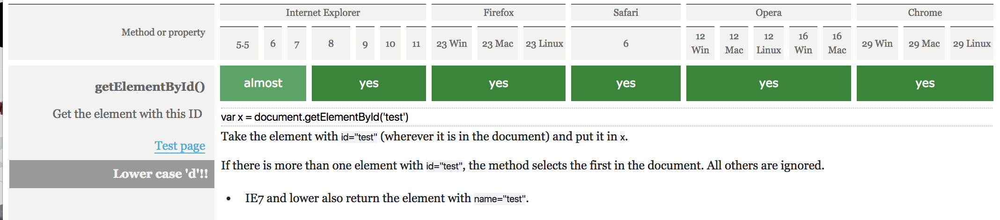

# Accordion
-	Een beschrijving van de feature.
This is a accordion module for showing more content after a click. The accordion is a nice addition for a FAQ or showing more information about a term.

-	Bronnen van uitleg en gebruikte artikelen.
## Sources
* [quirksmode table of contents about all selectors](https://quirksmode.org/dom/core/#fivemethods)
* [Impressive web CSS3 support in IE9](https://www.impressivewebs.com/css3-support-ie9/)

-	Welke browsers/devices ondersteunen deze wel/niet.

## Browser support

### Javascript

_The support for getElementsByClassName_

_The support for getElementById_

_The support for NextSibling_

_The support for NextSibling_

### CSS

-	Een beschrijving hoe de fallback werkt.

* [Link to accordion](https://vincentkempers.github.io/browser-technologies/opdracht2/accordion/)
* [Link to terms of service](https://vincentkempers.github.io/browser-technologies/opdracht2/terms-of-service/)
