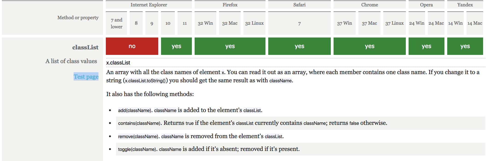

# Accordion
This is a accordion module for showing more content after a click. The accordion is a nice addition for a FAQ or showing more information about a term.
To challenge myself I kept IE9 in my mind while developing! I knew grid wouldn't work and as it was stated in the assignment it would be a module.
On positioning i didn't use much just `display: flex;` which isn't supported on IE9.

The accordion


-	Bronnen van uitleg en gebruikte artikelen.
## Sources
* [quirksmode table of contents about all selectors](https://quirksmode.org/dom/core/#fivemethods)
* [Impressive web CSS3 support in IE9](https://www.impressivewebs.com/css3-support-ie9/)
* [can i use](https://caniuse.com/)

-	Welke browsers/devices ondersteunen deze wel/niet.

## Browser support

### Javascript

_The support for getElementsByClassName_


_The support for getElementById_


_The support for NextSibling_


_The support for NextSibling_

### CSS

_vw vmin vh vmax support_

Transistions don't work on IE9.


_support CSS3 transitions_


_transitions are very buggy on opera mobile_

On opera mini it won't work because of the way opera works. It saves data to send "images" of de browser and it will know the coordinates of what you have clicked and show that page. Animation or transitions won't work (well) for that matter.


## Fallbacks

* flexbox
```CSS
element {
/* for older browsers IE9 and down the line */
  display: table;
/* older browser will not understand flex and ignore it.
Newer browsers wont */
  display: flex;
}
```


* [Link to accordion](https://vincentkempers.github.io/browser-technologies/opdracht2/accordion/)
* [Link to terms of service](https://vincentkempers.github.io/browser-technologies/opdracht2/terms-of-service/)
