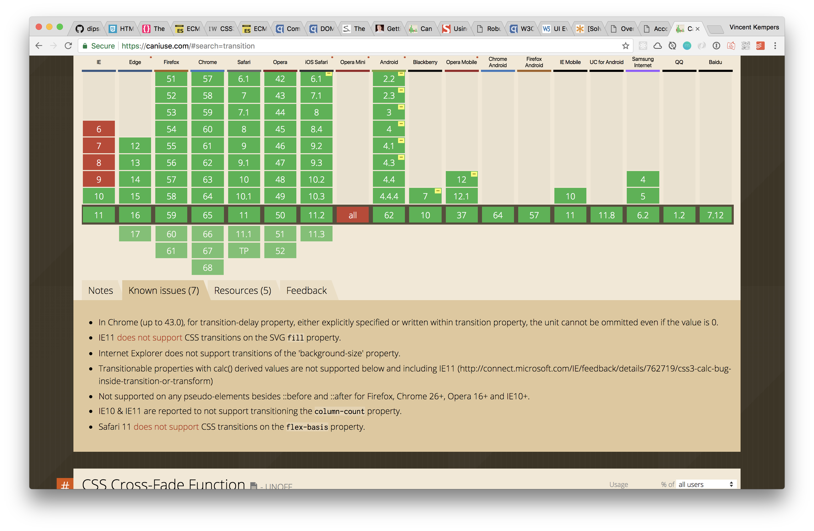
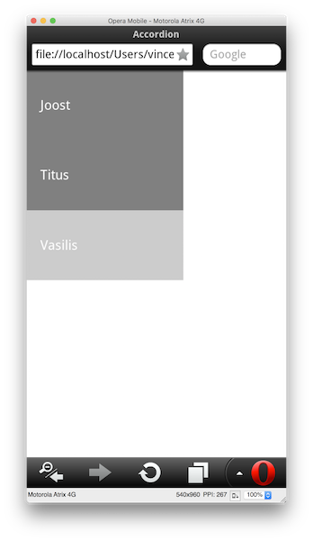

# Accordion
This is a accordion module for showing more content after a click. The accordion is a nice addition for a FAQ or showing more information about a term.
To challenge myself I kept IE9 in my mind while developing! I knew grid wouldn't work and as it was stated in the assignment it would be a module.
On positioning i didn't use much just `display: flex;` which isn't supported on IE9.

_Note: I probably should have experimented more! Due to time constraints I didn't made crazy enhancements._

[Link for the project](https://vincentkempers.github.io/browser-technologies/opdracht2/assignment/)

## Sources
* [quirksmode table of contents about all selectors](https://quirksmode.org/dom/core/#fivemethods)
* [Impressive web CSS3 support in IE9](https://www.impressivewebs.com/css3-support-ie9/)
* [can i use](https://caniuse.com/)

# Redo

| What i had to fix | Fixed     |
| :------------- | :------------- |
| I had to test on IE8  | Tested on IE8 |
| Add some text instead of lorem | wrote some clever stuff about some teachers |

## Browser support

### Javascript

_The support for getElementsByClassName_


_The support for getElementById_


_The support for NextSibling_


_The support for NextSibling_


_querySelectorAll support for ie8 is incomplete but technically it works for what i need it to do._


### CSS

_vw vmin vh vmax support_

Transistions don't work on IE9.


_support CSS3 transitions_


## Fallbacks

* flexbox

```CSS
element {
/* for older browsers IE9 and down the line */
  display: block;
  float: left;
  margin: 0 auto; /* or display: table;  */
/* older browser will not understand flex and ignore it.
Newer browsers wont */
  display: flex;
}
```

* Creating a fallback for JavaScript

```JS
if(document.getElementsByClassName) {
  // Run the code with get getElementsByClassName
  console.dir(document);
} else {
  // run the code with a different selector
  console.log("Not supported");
}
```

# link + overlay
I made a terms of service on this page so you can accept and decline and fill a checkbox. A background color is added to identify the user that this is the main "thing". You can exit anytime and it's made completely with CSS so there isn't that much Javascript going on. On the part of positioning i used `display: flex;`.


## Sources
* [quirksmode table of contents about all selectors](https://quirksmode.org/dom/core/#fivemethods)
* [Impressive web CSS3 support in IE9](https://www.impressivewebs.com/css3-support-ie9/)
* [can i use](https://caniuse.com/)


## Browser support
Because of the low Javascript usage are there only some CSS fallbacks needed to be created.
* Em's work til IE 9 without being "that" buggy.
* Usage of `display: flex;`.
* `:target` psuedo element should be supported on every browser except Opera mini and IE 7.


### Javascript

_The support for getElementById_


_The support for NextSibling_

### CSS

_The support for flexbox_


## Browser tests

Ways of testing:
* Browsers on my machine: Safari/ Google Chrome/ Firefox/ Opera Mobile Emulator/ opera/ Virtual Box
* My own windows machine: Internet Explorer 11 & 10/ Mozilla Firefox/ Google Chrome
* [Browserstack](https://www.browserstack.com/)
* [Browserling](https://www.browserling.com/)
* Device Lab

### Internet explorer

_ie 8_


_ie 9_

### bugs
* On ie8 it doesn't work.
* The assignment didn't call for ie8 support.
* But the basic functionality _showing text_ works.

* the target opens a new window. Which is just not what i wanted.
* Weirdly enough it worked on the first try and the overlay worked inside the browser.
* probably the target got messed up.


_IE 11_

#### Bugs
* This actually worked fine. The were no problems found on IE 9 or IE 11.

### Microsoft Edge


_Microsoft Edge_

#### Bugs
* There were no bugs found. with or without JS & CSS.


### Firefox


_Firefox_

##### Bugs
* There were no bugs found. with or without JS & CSS.

### Safari


#### Bugs
* There were no bugs found. with or without JS & CSS.
* tabbing was a bit weird in safari. I couldn't reach the website with tabbing.

### Opera mobile

_I couldn't test the terms of service button because the Emulator crashed every time_

On opera mini the animations won't work because of the way opera works. It saves data to send "images" of de browser and it will know the coordinates of what you have clicked and show that page. Animation or transitions won't work (well) for that matter.

#### Bugs
* My emulator breaks when I click the terms of service link. So i really wouldn't know if it's on my end or opera mobile really don't like the way how i handled this problem(just CSS).
* Besides that The animation is buggy, It will still show the active state but the transition is ignored(Pretty Progressive if you ask me).
* Besides that it works fine.

## Mobile browsers/ Device Lab

### Note:
The width wasn't edited of the accordion yet so this may look weird.

### Samsung phone


_sorry for the blurry image, but both worked fine_

#### Bugs
* There were no bugs found.

### android phone QP


#### bugs
* There were no bugs found. You can use it as normal.


### old android phone QP


#### Bugs
* There were no bugs found. You can use it as normal.

### Nexus


#### bugs
* Well the nexus was a one way ticket on the overlay. You couldn't press the exit button.
* This is a padding problem but the sizing isn't that "hard"-coded. the changes in value should fix this.
