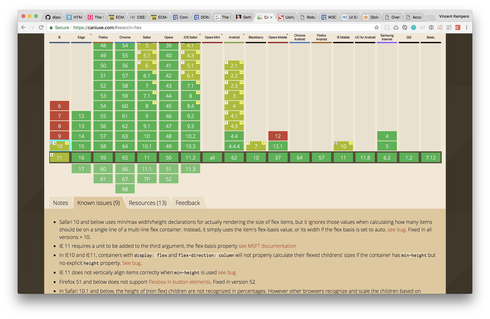

# link + overlay

On the part of positioning i used `display: flex;`.


-	Bronnen van uitleg en gebruikte artikelen.
## Sources
* [quirksmode table of contents about all selectors](https://quirksmode.org/dom/core/#fivemethods)
* [Impressive web CSS3 support in IE9](https://www.impressivewebs.com/css3-support-ie9/)

-	Welke browsers/devices ondersteunen deze wel/niet.

## Browser support

### Javascript


_The support for getElementById_


_The support for NextSibling_

### CSS

_The support for flexbox_


## fallback

* Flexbox fallback
```CSS
element {
/* for older browsers IE9 and down the line */
  display: table;
/* older browser will not understand flex and ignore it.
Newer browsers wont */
  display: flex;
}
```


* [Link to accordion](https://vincentkempers.github.io/browser-technologies/opdracht2/accordion/)
* [Link to terms of service](https://vincentkempers.github.io/browser-technologies/opdracht2/terms-of-service/)
